  

  
  
  

<h3 align="center">Em produção</h3>

  
  
  
  

<h3 align="center">Stack</h3>

  

<h3 align="center">Contribuições</h3>

  <picture>
    <source media="(prefers-color-scheme: dark)" srcset="https://raw.githubusercontent.com/MatheusHenriquePrates/MatheusHenriquePrates/output/cobrinha-escura.svg">
    <source media="(prefers-color-scheme: light)" srcset="https://raw.githubusercontent.com/MatheusHenriquePrates/MatheusHenriquePrates/output/cobrinha.svg">
    
  </picture>

Os repositórios fixados abaixo são ferramentas que publiquei, com documentação em português e inglês.

<b>In English</b>

 

AI engineer and full stack developer with a strong DevOps background, based in Goiânia, Brazil. I build AI systems end to end, from the application to the infrastructure that keeps it in production. Six systems running today, including an AI marketing SaaS with paying customers. Open to AI Engineer, Full Stack, Back-end and DevOps roles.

