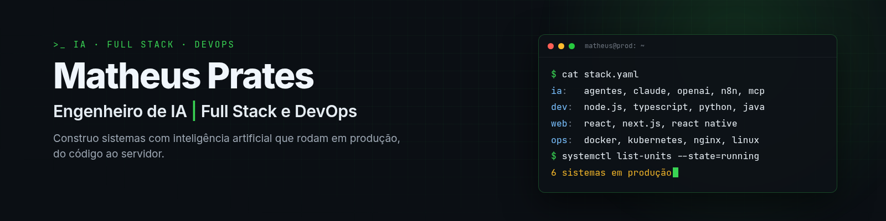

  

  
  
  
  

## Sobre mim

Sou engenheiro de IA e desenvolvedor full stack, com base sólida em DevOps. Construo sistemas com inteligência artificial de ponta a ponta: desenho a solução, desenvolvo a aplicação e cuido da infraestrutura que a mantém em produção.

Minha especialidade é IA aplicada a problemas reais de negócio: agentes, atendimento automatizado pelo WhatsApp, automações com n8n e integração de modelos de linguagem a sistemas que já existem. Comecei em suporte e infraestrutura, e por isso penso desde o início em como o sistema vai rodar, escalar e ser monitorado.

## Em produção

Sistemas que desenvolvi e mantenho. O código é privado; o que é público tem link.

| Sistema | O que faz | Stack |
|---|---|---|
| **Plataforma de marketing com IA** | SaaS com clientes pagantes. Vários agentes de IA geram, editam e revisam imagens e textos para redes sociais, com orquestração por n8n. | Node.js · NestJS · Next.js · PostgreSQL · Claude · OpenAI |
| **[Busca Vagas](https://buscavagas.pratechsolutions.com.br)** | Milhares de vagas de TI de Goiânia e remotas, atualizadas todos os dias, com busca, alertas e currículo ajustado para cada vaga. | Next.js · Fastify · TypeScript · PostgreSQL |
| **Tenaz** | Aplicativo que lê o atendimento no WhatsApp e, com IA, mantém os compromissos do dia em ordem. | React Native · Node.js · PostgreSQL · Claude |
| **PDV com NFC-e** | Ponto de venda em uso numa loja, com emissão de nota fiscal eletrônica. | React · Node.js · Prisma |

## Código aberto

Ferramentas que tirei do dia a dia e publiquei, com documentação em português e inglês.

**IA e agentes**

- [claude-oauth-bridge](https://github.com/MatheusHenriquePrates/claude-oauth-bridge): endpoint compatível com a API da OpenAI para usar o Claude em n8n, LangChain e afins.
- [mcp-multi-target-http](https://github.com/MatheusHenriquePrates/mcp-multi-target-http): servidor MCP que dá a um agente acesso a vários bancos e APIs atrás de um endpoint só, com cache e lista de SQL permitido.
- [claude-voice-assistant](https://github.com/MatheusHenriquePrates/claude-voice-assistant): assistente de voz em tempo real (Whisper, Claude e ElevenLabs) que responde antes de o modelo terminar.
- [uazapi-webhook](https://github.com/MatheusHenriquePrates/uazapi-webhook): receptor de mensagens do WhatsApp com fila no Postgres, idempotência, repetição e dead-letter.

**Plataforma e dados**

- [tenant-encrypted-datalake](https://github.com/MatheusHenriquePrates/tenant-encrypted-datalake): data lake multi-tenant com criptografia por cliente (HKDF e AES-256-GCM) e consultas isoladas em DuckDB.
- [multi-instance-ops-dashboard](https://github.com/MatheusHenriquePrates/multi-instance-ops-dashboard): painel de operações com BFF em Fastify, Next.js e cache no Redis.

<b>Infraestrutura</b>

 

- [claude-code-on-k3s](https://github.com/MatheusHenriquePrates/claude-code-on-k3s) e [claude-fleet-relay](https://github.com/MatheusHenriquePrates/claude-fleet-relay): frota de agentes Claude Code no Kubernetes, com comunicação controlada entre eles.
- [tenant-job-orchestrator](https://github.com/MatheusHenriquePrates/tenant-job-orchestrator): orquestração de tarefas por cliente com fila no próprio PostgreSQL.
- [wireguard-hub-patterns](https://github.com/MatheusHenriquePrates/wireguard-hub-patterns): padrões de VPN hub-and-spoke para ligar servidores em regiões diferentes.
- [atomic-pg-dump](https://github.com/MatheusHenriquePrates/atomic-pg-dump), [ssh-tunnel-systemd-template](https://github.com/MatheusHenriquePrates/ssh-tunnel-systemd-template), [fix-k3s-docker-bridge](https://github.com/MatheusHenriquePrates/fix-k3s-docker-bridge) e as rotinas de limpeza para [Docker](https://github.com/MatheusHenriquePrates/docker-frequent-cleanup), [VPS](https://github.com/MatheusHenriquePrates/linux-vps-cleanup-daily) e [K3s](https://github.com/MatheusHenriquePrates/k3s-daily-cleanup).

## Stack

| Área | Tecnologias |
|---|---|
| IA | Claude, OpenAI, agentes, MCP, n8n, LangChain |
| Back-end | Node.js, TypeScript, NestJS, Fastify, Python, Java, Spring Boot, .NET |
| Front-end e mobile | React, Next.js, React Native, Tailwind |
| Dados | PostgreSQL, Redis, DuckDB, SQL Server |
| Infraestrutura | Docker, Kubernetes (K3s), Nginx, Linux, WireGuard, Cloudflare, GitHub Actions |

## Agora

- Aberto a vagas de **Engenheiro de IA**, **Desenvolvedor Full Stack**, **Back-end** e **DevOps**: remoto, híbrido ou presencial em Goiânia.
- Mantendo seis sistemas em produção.
- Cursando Ciência da Computação.

<b>In English</b>

 

AI engineer and full stack developer with a strong DevOps background, based in Goiânia, Brazil. I build AI systems end to end: I design the solution, write the application and run the infrastructure that keeps it in production. My focus is applied AI: agents, WhatsApp customer service automation, n8n workflows and LLM integration with existing systems.

Currently running six systems in production, including an AI marketing SaaS with paying customers. Open to AI Engineer, Full Stack, Back-end and DevOps roles, remote or hybrid.

